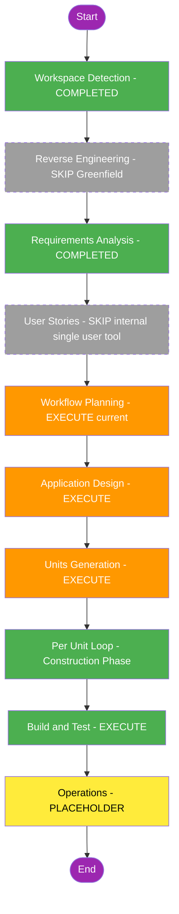

# 実行計画（Execution Plan）- 製造業設備稼働率監視ボード

## 1. 詳細分析サマリー

### スコープ
Greenfieldプロジェクト。マルチコンポーネント構成:
1. CSV疑似データ生成（生産フロー A→B→C→D→Eのシーケンシャル生成、理論生産数に基づくランダム化）
2. CSV → SSMS MERGE取り込み（重複防止・インデックス設計・ファイル移動）
3. 稼働率算出（日別/週別/週間想定/月別）
4. Streamlit WEBダッシュボード（折れ線グラフ、号機トグル、ツールチップ）
5. GitHub Actions（Self-hosted Runner）による12時間毎の定期実行

### 変更影響評価
- **ユーザー体験への影響**: あり（Streamlitダッシュボードはエンドユーザー＝現場担当者が直接閲覧）
- **システム構造への影響**: あり（新規システム一式）
- **データモデルへの影響**: あり（SSMSテーブル・CSVフォーマット・インデックス設計）
- **API/インターフェースへの影響**: なし（外部公開APIは持たない。Streamlit UIのみ）
- **非機能要件への影響**: あり（パフォーマンス=インデックス、可用性=Self-hosted Runner常時稼働、セキュリティ=Windows統合認証）

### リスク評価
**中(Medium)**: 複数コンポーネントにまたがるが、各コンポーネントの仕様は要件定義で明確化済み。主な不確実性はSelf-hosted Runnerのセットアップと、実データでの稼働率計算の境界値（日曜/月曜補正）の検証。

## 2. ワークフロー可視化

## 3. 実行するフェーズ／スキップするフェーズ

### INCEPTION PHASE
| ステージ | 状態 | 理由 |
|---|---|---|
| Workspace Detection | COMPLETED | 実施済み（Greenfield判定） |
| Reverse Engineering | SKIP | Greenfieldのため既存コードなし |
| Requirements Analysis | COMPLETED | 実施済み・承認済み |
| User Stories | SKIP | 単一ユーザー（現場担当者）向けの社内監視ツールであり、要件定義書でUI要件（グラフ種別・トグル・ツールチップ等）が既に具体的に定義済み。複数ペルソナや利害関係者調整も不要なため |
| Workflow Planning | EXECUTE | 現在実施中 |
| Application Design | EXECUTE | 5つの新規コンポーネント（CSV生成/DB取込/稼働率算出/WEB表示/自動実行）の責務・メソッド・依存関係を定義する必要があるため |
| Units Generation | EXECUTE | システムを複数の作業単位（ユニット）に分解する必要があるため（ユーザー要望の「最初のユニット提案」に直結） |

### CONSTRUCTION PHASE
| ステージ | 状態 | 理由 |
|---|---|---|
| Per-Unit Loop（Functional Design / NFR Requirements / NFR Design / Infrastructure Design） | ユニットごとに判定 | Units Generation完了後、各ユニットの性質に応じて個別に要否を判定する |
| Code Generation | EXECUTE（常時） | 各ユニットで必ず実施 |
| Build and Test | EXECUTE（常時） | 全ユニット完了後に実施 |

### OPERATIONS PHASE
| ステージ | 状態 | 理由 |
|---|---|---|
| Operations | PLACEHOLDER | 現バージョンでは未実装（将来拡張） |

## 4. 推定タイムライン
- 残りステージ数: Application Design、Units Generation（INCEPTION） + 各ユニットのConstruction一式 + Build and Test
- 詳細な工数は各ユニットの粒度確定後（Units Generation完了時）に確定する

## 5. 成功基準
- **主目的**: SSMSに蓄積された稼働データから、日別/週別/月別の稼働率をStreamlitダッシュボードでリアルタイムに近い形で可視化できること
- **主要成果物**: CSV生成スクリプト、DB取込（MERGE）スクリプト、稼働率算出スクリプト、Streamlitアプリ、GitHub Actionsワークフロー定義
- **品質ゲート**: 各ユニットのコード生成完了時にレビュー・承認、Build and Testステージでの動作確認
